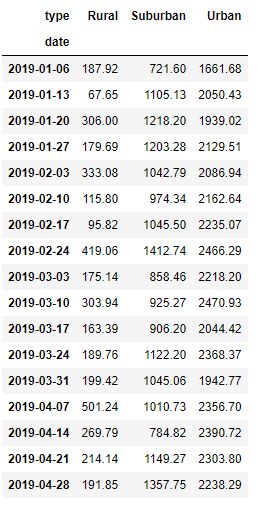
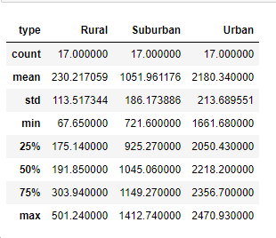
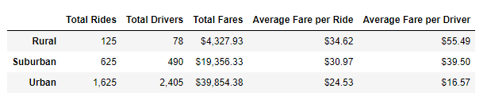

# PyBer_Analysis
## 1.	Overview of the analysis:
    1.	PyBer company’s top management want to know the how the trend of fare of each city type by weekly.
## 2.	Results:
    1.	Following points are observed,
        1.  Urban city has received highest total fare in all three types of cities. However, avg. fare per ride and avg. fare per driver is lowest among all three cities.
        2.  Urban city has highest number of drivers as well as total rides.
        3.  Rural city has lowest number of drivers as well as obtained lowest number of rides. However, Avg. fare per ride and Avg. fare per driver is high among all three cities.
        
        
        
## 3. Summary:
    1.	Urban city needs to concentrate on Average fare per ride is lowest in all three types of cities, needs to work on how to increase it.
    2.	 Rural city has lowest number of drivers and due to this reason average fare rate per ride and average fare per driver is higher.
    3.	 Urban city has collected highest total fare which is 921% higher with compare to Rural and 205.8% higher with compare to Suburban.
